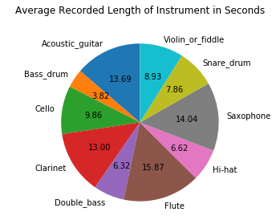
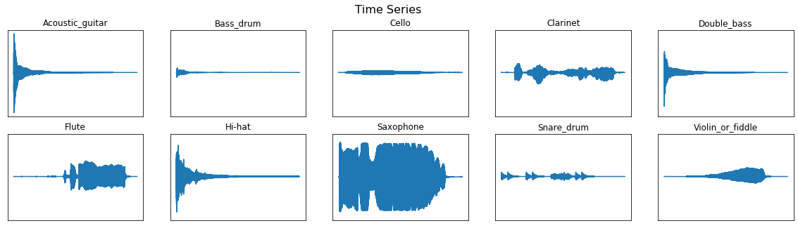
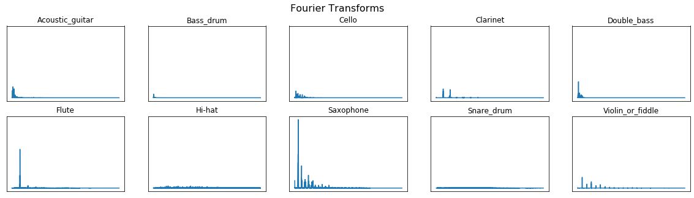
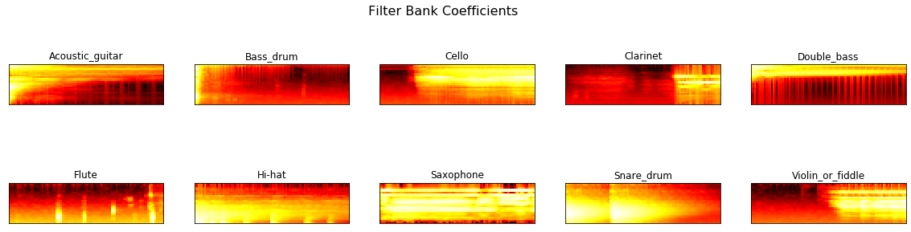
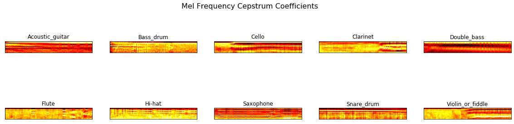
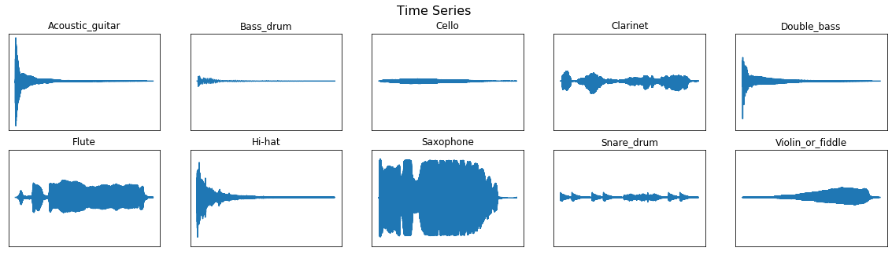

In this post is a tutorial along with code to develop a supervised audio classifier. The repository and more information about the data can be found [here](https://github.com/theadamsabra/Audio-Classifier).

## 1 - Exploratory Data Analysis

### 1.1 - Loading in Data


```python
import os
import sys
import numpy as np
import eda # Courtesy of Seth Adams
import librosa
import pandas as pd
from python_speech_features import mfcc, logfbank
from scipy.io import wavfile
from matplotlib import pyplot as plt
from tqdm import tqdm
from sklearn import svm
from sklearn.decomposition import PCA
from sklearn.pipeline import Pipeline
from sklearn.preprocessing import StandardScaler, Normalizer
from sklearn.naive_bayes import GaussianNB
```

We first see that the dataframe is simply 2 columns; the first being the name of the file and the second being the name of the instrument - which we will use as the labels in this classification problem.


```python
labels = pd.read_csv('instruments.csv')
```


```python
# Replace the numbered index with the type of instrument.
labels.set_index('fname', inplace = True)
```


```python
rateT, signalT = wavfile.read('wavfiles/5388d14d.wav')
print(rateT, signalT) # Audio was recorded at a rate of 44100 Hz and the signal is outputted as array
```

    44100 [-189 -245 -275 ...    1   -1   -1]
    

### 1.2 - Data Characteristics

#### 1.2.1 - Length of Signals

Another column will be added to add the length of each recording in seconds. This can be found through the ratio between the length of the signal and its rate.


```python
for f in labels.index:
    rate, signal = wavfile.read('wavfiles/'+f)
    labels.at[f, 'length'] = signal.shape[0] / rate #Len of signal / signal's rate = len of signal in seconds
labels
```


<div>
<style scoped>
    .dataframe tbody tr th:only-of-type {
        vertical-align: middle;
    }

    .dataframe tbody tr th {
        vertical-align: top;
    }

    .dataframe thead th {
        text-align: right;
    }
</style>
<table border="1" class="dataframe">
  <thead>
    <tr style="text-align: right;">
      <th></th>
      <th>label</th>
      <th>length</th>
    </tr>
    <tr>
      <th>fname</th>
      <th></th>
      <th></th>
    </tr>
  </thead>
  <tbody>
    <tr>
      <th>5388d14d.wav</th>
      <td>Saxophone</td>
      <td>4.14</td>
    </tr>
    <tr>
      <th>c685f05f.wav</th>
      <td>Saxophone</td>
      <td>1.54</td>
    </tr>
    <tr>
      <th>36d20ab5.wav</th>
      <td>Saxophone</td>
      <td>4.90</td>
    </tr>
    <tr>
      <th>d6665734.wav</th>
      <td>Saxophone</td>
      <td>10.50</td>
    </tr>
    <tr>
      <th>7352e28f.wav</th>
      <td>Saxophone</td>
      <td>6.24</td>
    </tr>
    <tr>
      <th>...</th>
      <td>...</td>
      <td>...</td>
    </tr>
    <tr>
      <th>3c713bcf.wav</th>
      <td>Clarinet</td>
      <td>6.14</td>
    </tr>
    <tr>
      <th>2fc00271.wav</th>
      <td>Clarinet</td>
      <td>4.20</td>
    </tr>
    <tr>
      <th>b0c06255.wav</th>
      <td>Clarinet</td>
      <td>4.08</td>
    </tr>
    <tr>
      <th>71c6451f.wav</th>
      <td>Clarinet</td>
      <td>3.56</td>
    </tr>
    <tr>
      <th>5de123c3.wav</th>
      <td>Clarinet</td>
      <td>3.34</td>
    </tr>
  </tbody>
</table>
<p>300 rows × 2 columns</p>
</div>


#### 1.2.2 -  Class Study of Instruments
When it comes to any classification problem, we first need to understand the data we're going to be learning from. It would be brash to assume from the get-go that there are an equal amount of instruments recorded. Finding the distribution of the instruments along the data will be a good first start for that.


```python
classes = list(np.unique(labels.label)) # Find all unique instruments in data
```


```python
labels.groupby(['label']).count()
```


<div>
<style scoped>
    .dataframe tbody tr th:only-of-type {
        vertical-align: middle;
    }

    .dataframe tbody tr th {
        vertical-align: top;
    }

    .dataframe thead th {
        text-align: right;
    }
</style>
<table border="1" class="dataframe">
  <thead>
    <tr style="text-align: right;">
      <th></th>
      <th>length</th>
    </tr>
    <tr>
      <th>label</th>
      <th></th>
    </tr>
  </thead>
  <tbody>
    <tr>
      <th>Acoustic_guitar</th>
      <td>30</td>
    </tr>
    <tr>
      <th>Bass_drum</th>
      <td>30</td>
    </tr>
    <tr>
      <th>Cello</th>
      <td>30</td>
    </tr>
    <tr>
      <th>Clarinet</th>
      <td>30</td>
    </tr>
    <tr>
      <th>Double_bass</th>
      <td>30</td>
    </tr>
    <tr>
      <th>Flute</th>
      <td>30</td>
    </tr>
    <tr>
      <th>Hi-hat</th>
      <td>30</td>
    </tr>
    <tr>
      <th>Saxophone</th>
      <td>30</td>
    </tr>
    <tr>
      <th>Snare_drum</th>
      <td>30</td>
    </tr>
    <tr>
      <th>Violin_or_fiddle</th>
      <td>30</td>
    </tr>
  </tbody>
</table>
</div>


```python
class_dist = labels.groupby(['label'])['length'].mean()
class_dist
```


    label
    Acoustic_guitar     6.948667
    Bass_drum           1.937333
    Cello               5.000667
    Clarinet            6.596000
    Double_bass         3.206000
    Flute               8.054667
    Hi-hat              3.357333
    Saxophone           7.124000
    Snare_drum          3.987333
    Violin_or_fiddle    4.530000
    Name: length, dtype: float64


```python
prob_dist = np.array(class_dist / class_dist.sum())
```


```python
fig, ax = plt.subplots()
ax.set_title('Average Recorded Length of Instrument in Seconds', y = 1.1)
ax.pie(class_dist, labels=class_dist.index, shadow = False, autopct ='%.2f', startangle = 90)
ax.axis('equal')
plt.show()
```





In this case, a brash assumption ended up correct in that there were an equal amount of instruments recorded in this dataset. However, another step needed to be taken to understand the characteristics of each instrument by finding the instrument's average length as the length of the audio is proportional to the amount of data that comes from it.

### 1.3 - Instrument Filtering and Analysis

This section mainly covers an overview visual analysis of the instruments, their Fourier Transformation, their Filter Bank Coefficients, and their Mel Frequency Cepstrum Coeffiecients.


```python
labels.reset_index(inplace=True)
```


```python
def fft_calc(y, rate):
    n = len(y)
    freq = np.fft.rfftfreq(n, d=(1/rate))
    Y = abs(np.fft.rfft(y)/n)
    return (Y, freq)
```


```python
# Testing to retreive file name
cT = classes[0]
wavT = labels[labels.label == cT].iloc[0,0]
wavT
```


    '17f82c05.wav'


- `nfilt`: Number of filters. This is traditionally 26.
- `nfft`: Fast Fourier Transform (FFT) size. While it is traditionally 512, we are using 1103 as the audio was recorded in 44100 Hz. Divide this number by 40 and we will get 1102.5. From there we round up.
- `numcep`: Number of cepstrum returned: traditionally 13 (half of the filters.) Assume we have a signal comprised of two other signals. The ceptstrum represents the two signals summed up to form the single signal.


```python
# Plotting and cleaning. Displaying one example from each class
sig = {}
fft = {}
fbank = {}
mfccs = {}

for c in classes:
    wav_file = labels[labels.label == c].iloc[0,0]
    signal, rate = librosa.load('wavfiles/'+ wav_file, sr = 44100)
    sig[c] = signal
    fft[c] = fft_calc(signal, rate)
    
    bank = logfbank(signal[:rate], rate, nfilt = 26, nfft = 1103).T
    fbank[c] = bank
    
    mel = mfcc(signal[:rate], rate, numcep=13, nfilt = 26, nfft = 1103).T
    mfccs[c] = mel
```

#### 1.3.1 - Time Series
The plots below represents the signals of the 10 instruments as a time series. One thing to note is that all the instruments will have "dead space" either in the beginning or the end of their signals. A filter (which is simply a numerical lower bound) will have to be put in place for this. Anything lower than the bound will be considered to be silent noise and will be filtered out. This methodology is called noise threshold detection.


```python
eda.plot_signals(sig)
```





#### 1.3.2 - Fourier Transformations

When dealing with signal processing, one of the first things that is used to analyze the signals is using a Fourier Transform. As we can see from the results below, most of the instruments show to be a flat line or something close to one. This means that the sound is evenly distributed across the recording. However, this doesn't help us much as many different instruments share this characteristic.


```python
eda.plot_fft(fft)
```





#### 1.3.3 - Filter Bank Coeffiecients

This shows for some more characteristics and personality between the instruments, which is a good sign.


```python
eda.plot_fbank(fbank)
```





#### 1.3.4 - Mel Frequency Cepstrum Coefficients

From the Filter Bank Coefficients, we can determine the Mel Frequency Cepstrum Coefficients (MFCCs.) Using the instruments' MFCCs allows us to further visually distinguish the instruments with no further mathematical rigor or calculation. Unlike the Filter bank coefficients, MFCCs are not dependent on time. This is what will be used in classification.


```python
eda.plot_mfccs(mfccs)
```





### 1.4 - Noise Threshold Detection

This can be done by creating a signal envelope to approximate the signals. In our case, we will just use an upper envelope.


```python
def envelope(signal, rate, threshold):
    mask = []
    signal = pd.Series(signal).apply(np.abs) # Convert to series to find rolling average and apply absolute value to the signal at all points. 
    signal_mean = signal.rolling(window = int(rate/10), min_periods = 1, center = True).mean() # Take the rolling average of the series within our specified window.
    
    for mean in signal_mean:
        if mean > threshold:
            mask.append(True)
        else:
            mask.append(False)
    return np.array(mask)
```


```python
sig_new = {}

# Clean displayed audio from above.
for c in classes:
    wav_file = labels[labels.label == c].iloc[0,0]
    signal, rate = librosa.load('wavfiles/'+ wav_file, sr = 44100)
    mask = envelope(signal, rate, 0.0005)
    signal = signal[mask]
    sig_new[c] = signal

eda.plot_signals(sig_new)
```





As we can see, not all the instruments had their "dead" sections filtered out. This most likely means that those flatter portions of the signal is relevant to the noise the instrument is producing. If we compare the flute above to its first time series, we will see where the beginning and end of the sound got filtered out.

### 1.5 - Data Cleaning for Model Preparation


```python
# Clean all audio data 
if len(os.listdir('clean')) == 0:
    for f in tqdm(labels.fname):
        signal, rate = librosa.load('wavfiles/'+f, sr=16000)
        mask = envelope(signal, rate, 0.005)
        wavfile.write(filename = 'clean/'+f, rate = rate, data = signal[mask])
```

## 2 - Model Preparation

Now that the data has been observed and cleaned, the audio will be converted into $x$ and $y$ values which represent the audio and the instrument name or label, respectively.

Audio produces a significant amount of data and because of this, each recording needs to be sampled by a certain time window split up into intervals. In this case, the sample will consist of 1 second recordings split up into $\frac{1}{10}$ second intervals.


```python
labels.set_index('fname', inplace = True)
```

### 2.1 - Creating the Data Sampling Process


```python
# First, we configure to the audio's properties
class Config:
    def __init__(self, nfilt = 26, nfeat = 13, nfft = 512, rate = 16000):
        self.nfilt = nfilt
        self.nfeat = nfeat
        self.nfft = nfft
        self.rate = rate
        self.step = int(rate/10)
```


```python
def random_sampling():
    x = []
    y = []
    for _ in range(n_samples):
        rand_class = np.random.choice(class_dist.index, p = prob_dist) # Random class (instrument) chosen
        file = np.random.choice(labels[labels.label == rand_class].index) # Random file from instrument class
        rate, wav = wavfile.read('clean/'+ file)
        label = labels.at[file, 'label']
        try:
            rand_index = np.random.randint(0, wav.shape[0] - config.step)
        except:
            continue # Some signals are too short and therefore cannot be used in testing/training
        sample = wav[rand_index: rand_index + config.step]
        x_sample = mfcc(sample, rate, numcep = config.nfeat, 
                        nfilt = config.nfilt, nfft = config.nfft).T
        x.append(x_sample.reshape(-1))
        y.append(classes.index(label))
    
    x, y = np.array(x), np.array(y)
    return x, y
```

### 2.2 - Sampling From Data


```python
n_samples = 10000
prob_dist = class_dist / class_dist.sum()
choice = np.random.choice(class_dist.index, p = prob_dist)
config = Config()

x_train, y_train = random_sampling()
print(x_train.shape, y_train.shape)

n_samples = 2500
x_test, y_test = random_sampling()
print(x_test.shape, y_test.shape)

# Saving numpy arrays so I don't have to load this cell every time I run the notebook
np.save('samples/xTrain', x_train)
np.save('samples/yTrain', y_train)
np.save('samples/xTest', x_test)
np.save('samples/yTest', y_test)
```

    (9975, 117) (9975,)
    (2495, 117) (2495,)
    

## 3 - Model Comparison

Two pipelines will be built to preprocess the data and compare a Support Vector Classifier (SVC) from a Gaussian Naive Bayes Classifier - as these two methods often generalize best in higher dimension data.


```python
SVC = Pipeline([
    ('Standard Scaler', StandardScaler()),
    ('PCA', PCA(n_components = 10)),
    ('SVM', svm.SVC(gamma = 'auto'))
])

GNB = Pipeline([
    ('Normalizer', Normalizer()),
    ('Gaussian Naive Bayes', GaussianNB())
])
```


```python
pipelines = [SVC, GNB]
```


```python
pipe_dict = {0: 'SVC', 1: 'GNB'}
for p in tqdm(pipelines):
    p.fit(x_train, y_train)
```

    100%|████████████████████████████████████████████████████████████████████████████████████| 2/2 [00:07<00:00,  3.74s/it]
    


```python
for i,model in enumerate(pipelines):
    print('{} Accuracy: {}'.format(pipe_dict[i], model.score(x_test, y_test)))
```

    SVC Accuracy: 0.9799599198396793
    GNB Accuracy: 0.6084168336673347
    
