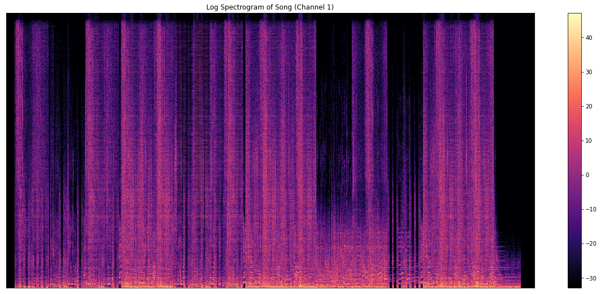
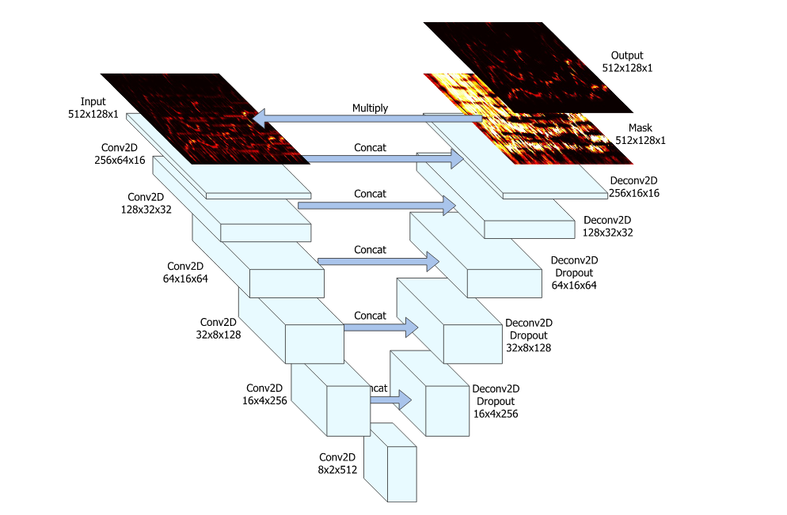

# Introduction

The challenge of audio source separation has always been a challenging one for audio engineers. Audio source separation is often referred to as the cocktail party problem, where one is attending a cocktail party and honing in on one conversation among the dozens around them. This problem, for many years, was considered to be extremely difficult. However, with the optimization of Convolutional Neural Networks (CNN)  - via AlexNet0 - the problem's solution approached with the new techniques that arose from this neural network. In this post, I aim to break down how to use a variant of the CNN on [DSD100](https://sigsep.github.io/datasets/dsd100.html) to extract the sounds provided by the dataset.

## About the Data Set

DSD100 [2] is a Deep Learning dataset that allows for researchers in the audio space to work on audio source separation. In it, contains 100 songs. Each song contains its final mixed version and its four stems: bass, vocals, drums, and other sounds. The mixed version acts as the input, $x$, whereas one of the four stems - in our case, the vocals - acts as our output, $y$.

# Processing the Data

## Fast Fourier Transformation

To process the data for relevant results, digital signal processing techniques must be used to extract meaningful features for the neural network to understand and recognize. These techniques are predominately Fourier-based spectrograms. The Fourier Transformation allows for us to mathematically decompose complex signals into their constituents. We examine the Fourier Transformation, more specifically, the Fast Fourier Transformation (FFT) which is used in Python [3]:

$$ \hat x_k = \frac{1}{\sqrt{N}} \displaystyle\sum_{n=0}^{m-1} x_{2n} \omega_{m}^{nk} + \frac{\omega_N}{\sqrt{N}} \displaystyle\sum_{n = 0}^{m-1}x_{2n+1} \omega_{m}^{nk}$$

This equation splits up the original Discrete Fourier Transformation into two sums: one along the odd indices, and another along the even indices. This version of the transformation can be modeled much more efficiently on a computational basis due to its recursive nature.

## Spectrograms

Once the constituent signals can determined, we can use the results to develop a spectrogram. A spectrogram allows humans to visualize the spectrum of frequencies of a recorded signal, hence its name. This kind of visualization is key for a CNN to examine and determine features of the recorded sound the same way the network would for images. In short, spectrograms allows researchers to mimic the image recognition process for audio-based tasks.

The process to create a spectrogram is as follows:

- Take signal and window, or slice into small pieces. Generally, these windows will overlap and be milliseconds long.
- Perform FFT and compute the square magnitude along each window.

Here is a spectrogram of one of the songs of the dataset:

As you can see, the details of the song can be extracted by the network at the granular level. This allows for increased accuracy and feature extraction while the CNN examines the song.

# Building the U-Net Convolutional Network

As detailed above, when using a spectrogram, the problem can be approached similarly to image-to-image translation. This was experimented and tested by ([Jansson et al.](https://pdfs.semanticscholar.org/83ea/11b45cba0fc7ee5d60f608edae9c1443861d.pdf)) [1] receiving favorable results. This section aims to highlight and detail the U-Net architecture used to create an auditory mask over the mixed recording to extract the vocals.

*Figure courtesy of Jansson et al.*

As seen from the figure above, the input spectrogram is of shape $(512,128,1)$. To preserve space and time during the network's training process, each song is downsampled and processed, making the spectrogram's length of $128$ equate to $\approx 11$ milliseconds. The feature extraction and learning process happens during the Conv2D and Deconv2D process.

During convolution, using a kernel size of $(5 \times 5)$ and stride $(2 \times 2)$, the neural network begins to shrink the spectrogram along its width and height and, to compensate for this, will increase its depth. This manipulation in shape is how feature extraction takes place. It is also important to note the concatenation among layers. By concatenating among the Conv2D and equivalent Deconv2D tensors, we are able to merge both higher and lower level information for increased results. The smaller the depth of the tensor, the higher the level of features extracted. This means that by the time the spectrogram has been compressed down to $(8,2,512)$, the features extracted are at an extremely low level. The deconvolution process - also known as the convolution transpose process - the low level features extracted are then scaled back up to the initial tensor shape of $(512,128,1)$, and the instrumental mask is formed. To isolate the vocals with the mask given, we simply multiply the output of the neural network to the input. The final output is then compared to the true $y$ with the following loss function:

$$L(y,\hat{y}) = \lvert\lvert \hat{y} - y \rvert\rvert $$

where $\hat{y} = f(x; \theta) x$.

Notes during the training process:
- Each Conv2D layer is batch normalized and has an activation layer of leaky rectified linear units with an $\alpha = 0.2$

- The deconvolution process possesses the same kernel size and stride. However, the activation layer is a standard rectified linear units and the first 3 deconvolution layers are followed by a dropout layer with a 50% rate. Dropout, as the name implies, drops a certain percentage of neurons of the network. The percentage is determined before the training process.

#### ReLU (Rectified Linear Unit):

$$ f(x) = \max(0,x) $$

#### Leaky ReLU:

$$ f(x) = \max(\alpha x, x) $$

# References:
[1] Jansson, A. et al. “Singing Voice Separation with Deep U-Net Convolutional Networks.” ISMIR (2017). https://pdfs.semanticscholar.org/83ea/11b45cba0fc7ee5d60f608edae9c1443861d.pdf

[2]  Antoine  Liutkus,   Fabian-Robert  Stoter,   Zafar  Rafii,   Daichi  Kitamura,Bertrand  Rivet,  Nobutaka  Ito,  Nobutaka  Ono,  and  Julie  Fontecave.   The 2016  signal  separation  evaluation  campaign.   In  Petr  Tichavsky,  MassoudBabaie-Zadeh, Olivier J.J. Michel, and Nadege Thirion-Moreau, editors,La-tent Variable Analysis and Signal Separation - 12th International Confer-ence, LVA/ICA 2015, Liberec, Czech Republic, August 25-28, 2015, Pro-ceedings, pages 323–332, Cham, 2017. Springer International Publishing. https://sigsep.github.io/datasets/dsd100.html

[3] Cooley, James W., and John W. Tukey, 1965, “An algorithm for the machine calculation of complex Fourier series,” Math. Comput. 19: 297-301. https://numpy.org/doc/stable/reference/generated/numpy.fft.fft.html
